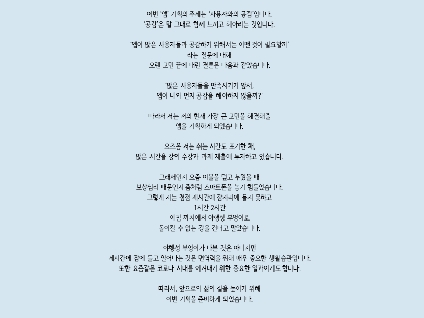
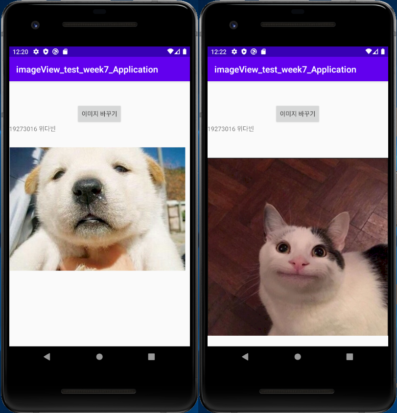

# 19273016 위다빈

## 1 주차 과제

-1주차 강의 퀴즈 정답 : 리눅스

## 2 주차 과제

-2주차(9월7일~9월13일)에 제출한 과제

</img>

-3주차 강의(3개중 1번째)를 수강하며 다시 편집(버튼위치, 사진크기 등...)하여 올린 2주차 과제 

</img>

## 3 주차 과제

-3주차 과제

</img>

## 4 주차 과제

-4주차 과제
: 개발할 앱의 전체적인 느낌을 배경에 표현해보았습니다.

</img>

</img>

## 5 주차 과제

-5주차 과제
: 자바에서 사용되는 상속,오버라이딩,오버로딩에 대한 개념을 요약제출 ---> lms로 제출 완료

## 6 주차 과제

-6주차 과제
: ZOM수업

## 7 주차 과제

-7주차 과제
: 이미지 바꾸기 버튼으로 뷰의 그림('예의바른 고양이 올리'와 '추운 강아지')을 바꾸기 

</img>

## 9 주차 과제

-9주차 과제
: 스크롤뷰 이용하기, 버튼을 이용하여 토스트메세지 띄우기

</img>

:왼쪽부터 순서대로 에뮬레이터 실행 후 '기본 화면' , '오른쪽으로 스크롤' , '아래쪽으로 스크롤' 한 화면 입니다.

</img>

:왼쪽부터 순서대로 에뮬레이터 실행 후 '첫번째 버튼 클릭' , '두번째 버튼 클릭' , '세번째 버튼 클릭' 한 화면 입니다.   
 (버튼을 클릭한 후에 다시 초기화하여 다음 버튼을 클릭하였습니다.)

## 10 주차 과제

-10주차 과제
: 레이아웃 익히기, SMS 입력화면 만들고 글자 수 표시하기

</img>
